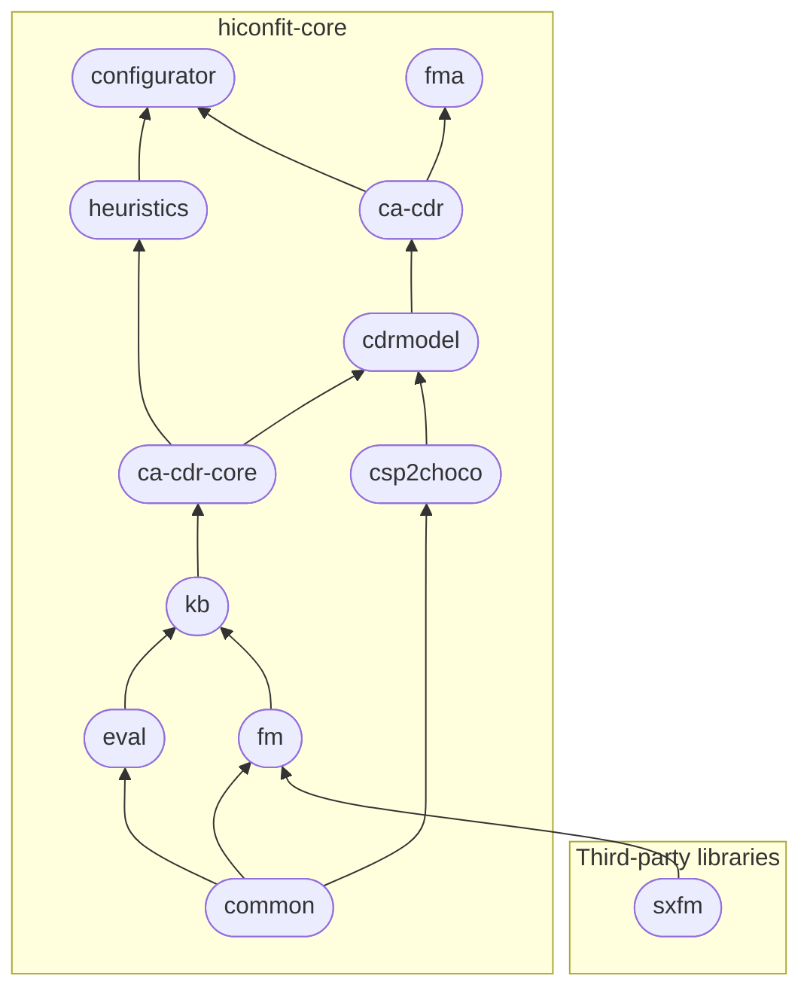

# hiconfit-core
{: .no_toc }
{: .d-inline-block }

v1.0
{: .label .label-purple }

**hiconfit-core** provides a set of Maven-based libraries for High-Performance Knowledge Based Configuration Techniques.

## Key libraries

### ca-cdr

[_**ca-cdr**_] offers Consistency-based Algorithms for Conflict Detection and Resolution.

_Conflict Detection and Resolution_ (CDR) is a substantial task in _Knowledge Base Engineering_ (KBE). [_**ca-cdr**_] publishes our implementations of CDR consistency-based algorithms, which can be applied throughout all phases of KBE, i.e., _design_, _testing and debugging_, and _configuration_.

1. QuickXPlain [1]
2. FastDiag [2]
3. MSS-based FastDiag [15]
4. FlexDiag [3]
5. HS-tree [8]
6. HSDAG [9]
7. DirectDebug [4, 5, 6, 7]
8. DirectDiag
9. WipeOutR_T [12, 13]
10. WipeOutR_FM [12, 13]
11. AggregatedTest [14] COMING SOON{: .label .label-yellow .fs-1 }
12. LevelWiseParallelHSDAG [10, 11] COMING SOON{: .label .label-yellow .fs-1 }
13. FullParallelHSDAG [10, 11] COMING SOON{: .label .label-yellow .fs-1 }
14. FastDiagP [15, 16] COMING SOON{: .label .label-yellow .fs-1 }
15. KBDiag [the related paper submitted on April 2023] COMING SOON{: .label .label-yellow .fs-1 }
16. InformedQX COMING SOON{: .label .label-yellow .fs-1 }
17. ParallelWipeOutR_T COMING SOON{: .label .label-yellow .fs-1 }
18. ParallelWipeOutR_FM COMING SOON{: .label .label-yellow .fs-1 }

### fma

[_**fma**_] is a Feature Model Testing and Debugging library.

The library provides a mechanism to automatically generate property-based test cases and allows the automated determination of faulty elements in feature models.

Two key features:

1. [_**fma**_] provides a mechanism to automatically generate property-based test cases for feature models. Test cases are generated based on six basic analysis operations, including _void feature models_, _dead features_, _conditionally dead features_, _full mandatory features_, _false optional features_, and _redundant constraints_, which are considered anomalies in feature models.
2. On the basis of the generated test cases, [_**fma**_] allows checking whether a feature model contains one or more of these six anomalies and executes asynchronous test case validation as well as corresponding diagnosis. It uses three algorithms, namely _**DirectDebug**_, _**WipeOutR_FM**_, and _**HSDAG**_, to determine all explanations for the anomalies in the feature model.

### configurator

[_**configurator**_] offers a compact knowledge-based configurator that supports the state-of-the-art Matrix Factorization-based Configuration and Recommendation.

## All libraries of hiconfit-core

**hiconfit-core** is organized in 11 following Maven libraries:

| *library*                                       | *description*                            |
|:----------------------------------------------|:------------------------------------------|
| [common] | provides utility functions |
| [csp2choco] | provides a translator converting CSP constraints into Choco Solver commands |
| [eval]     | provides a performance evaluator, including counters and timers, to measure the performance of algorithms |
| [fm]         | provides the management functionalities for basic feature models |
| [kb]    | provides classes managing CSP (Choco) representations of a knowledge base/feature model |
| [ca-cdr-core]  | provides core classes for representing user requirements and solutions of a configurator as well as for managing test cases and test suites |
| [cdrmodel] | provides a programmatic approach to manage/prepare the constraints/test cases for consistency-based algorithms |
| [ca-cdr]     | provides implementations of Consistency-based Algorithms for Conflict Detection and Resolution (CA-CDR) and a ChocoConsistencyChecker |
| [heuristics]         | provides an implementation of Matrix Factorization Based Variable and Value Ordering Heuristics for Constraint Solving and a wrapper for Matrix Factorization algorithm on the basis of the Mahout library |
| [configurator] | provides a compact knowledge-based configurator supporting Matrix Factorization based Configuration and Recommendation |
| [fma]    | provides a mechanism to automatically generate property-based test cases for feature models and allows the automated determination of faulty constraints in the feature model |

The following diagram shows the libraries' dependency.

<!-- Links -->
[_**ca-cdr**_]: /core/ca-cdr
[ca-cdr]: /core/ca-cdr
[cdrmodel]: /core/cdrmodel
[ca-cdr-core]: /core/ca-cdr-core
[kb]: /core/kb
[fm]: /core/fm
[eval]: /core/eval
[csp2choco]: /core/csp2choco
[common]: /core/common
[fma]: /core/fma
[_**fma**_]: /core/fma
[configurator]: /core/configurator
[_**configurator**_]: /core/configurator
[heuristics]: /core/heuristics