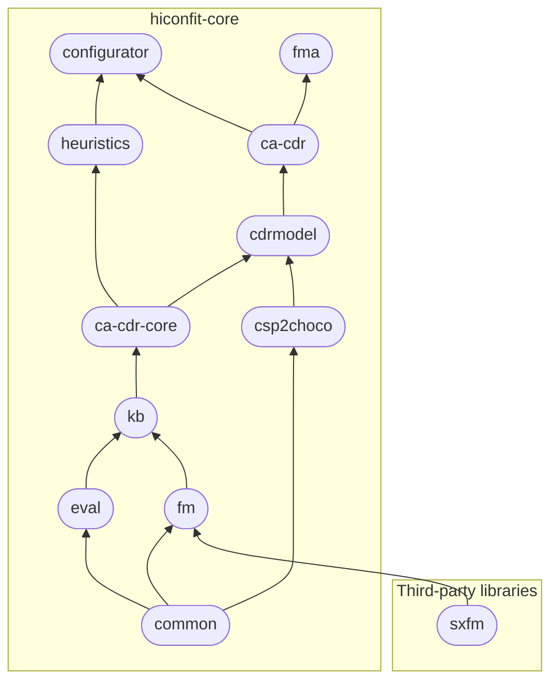

# How to get the libraries
{: .no_toc }

We publish libraries of **hiconfit-core** in Maven packages hosted by [GitHub Packages].
In this page, you'll find how to import these Maven libraries into your Java project.

## Table of Contents
{: .no_toc .text-delta }

1. TOC
{:toc}

## Authenticating to GitHub Packages

In your Maven project, please add the below script in the `settings.xml` file.



<?xml version="1.0" encoding="UTF-8"?>
<settings xmlns="http://maven.apache.org/SETTINGS/1.0.0"
    xmlns:xsi="http://www.w3.org/2001/XMLSchema-instance"
    xsi:schemaLocation="http://maven.apache.org/SETTINGS/1.0.0 http://maven.apache.org/xsd/settings-1.0.0.xsd">
    <servers>
        <server>
            <id>github-maven-repository</id>
            <username>USERNAME</username>
            <password>TOKEN</password>
        </server>
    </servers>
</settings>





Replacing `USERNAME` with your GitHub username, and `TOKEN` with your personal access token (see [Creating a personal access token]).

## Connecting to our repositories

Add also the below script into the `pom.xml` file:



<profiles>
    <profile>
        <id>github-maven-repository</id>
        <repositories>
            <repository>
                <id>github-maven-repository</id>
                <url>https://maven.pkg.github.com/HiConfiT/*</url>
            </repository>
        </repositories>
    </profile>
</profiles>





## Installing the libraries

Add the library dependencies to the `dependencies` element of your project `pom.xml` file.



<dependency>
    <groupId>at.tugraz.ist.ase</groupId>
    <artifactId>ARTIFACT_ID</artifactId>
    <version>VERSION</version>
</dependency>





Replacing `ARTIFACT_ID` and `VERSION` with the corresponding information from the following table.
_Legend_: stable version{: .label .label-green .fs-1 } latest version{: .label .label-purple .fs-1 }

|*artifact_id*                                       | *versions* | *description*                            |
|:----------------------------------------------|:------------------------------------------|:---|
| [common] | 1.0{: .label .label-green .fs-1 } 1.1.0-alpha-1{: .label .label-purple .fs-1 } | provides utility functions |
| [csp2choco] | 1.0{: .label .label-green .fs-1 } 1.1.0-alpha-1{: .label .label-purple .fs-1 } | provides a translator converting CSP constraints into Choco Solver commands |
| [eval]      | 1.0{: .label .label-green .fs-1 } 1.1.0-alpha-1{: .label .label-purple .fs-1 } | provides a performance evaluator, i.e., counters and timers, which could be used to measure the performance of algorithms |
| [fm]         | 1.0{: .label .label-green .fs-1 } 1.1.0-alpha-1{: .label .label-purple .fs-1 } | provides the management functionalities for basic feature models |
| [kb]    | 1.0{: .label .label-green .fs-1 } 1.1.0-alpha-1{: .label .label-purple .fs-1 } | provides classes managing CSP (Choco) representations of a knowlege base/feature model |
| [ca-cdr-core]  | 1.0{: .label .label-green .fs-1 } 1.1.0-alpha-1{: .label .label-purple .fs-1 .lowercase } | provides core classes for representing user requirements and solutions of a configurator as well as for managing test cases and test suites |
| [cdrmodel] | 1.0{: .label .label-green .fs-1 } 1.1.0-alpha-1{: .label .label-purple .fs-1 } | provides an programmatic approach to manage/prepare the constraints/test cases for consistency-based algorithms |
| [ca-cdr]  | 1.0{: .label .label-green .fs-1 } 1.1.0-alpha-1{: .label .label-purple .fs-1 .lowercase } | provides implementations of Consistency-based Algorithms for Conflict Detection and Resolution (CA-CDR) and a ChocoConsistencyChecker |
| [heuristics]         | 1.0{: .label .label-green .fs-1 } 1.1.0-alpha-1{: .label .label-purple .fs-1 } | provides an implementation of Matrix Factorization Based Variable and Value Ordering Heuristics for Constraint Solving and a wrapper for Matrix Factorization algorithm on the basis of the Mahout library |
| [configurator] | 1.0{: .label .label-green .fs-1 } 1.1.0-alpha-1{: .label .label-purple .fs-1 } | provides a compact knolwedge-based configurator supporting Matrix Factorization based Configuration and Recommendation |
| [fma]    | 1.0{: .label .label-green .fs-1 } 1.1.0-alpha-1{: .label .label-purple .fs-1 } | provides a mechnism to automatically generate property-based test cases for feature models and allows the automated determination of faulty constraints in the feature model |

## Dependency of libraries

<!-- Links -->
[ca-cdr]: https://github.com/HiConfiT/hiconfit-core/packages/1866796
[cdrmodel]: https://github.com/HiConfiT/hiconfit-core/packages/1866793
[kb]: https://github.com/HiConfiT/hiconfit-core/packages/1866791
[fm]: https://github.com/HiConfiT/hiconfit-core/packages/1866787
[eval]: https://github.com/HiConfiT/hiconfit-core/packages/1866789
[csp2choco]: https://github.com/HiConfiT/hiconfit-core/packages/1866786
[common]: https://github.com/HiConfiT/hiconfit-core/packages/1866785
[ca-cdr-core]: https://github.com/HiConfiT/hiconfit-core/packages/1876877
[configurator]: https://github.com/HiConfiT/hiconfit-core/packages/1875776
[fma]: https://github.com/HiConfiT/hiconfit-core/packages/1875777
[heuristics]: https://github.com/HiConfiT/hiconfit-core/packages/1875775
<!-- [mf]: https://github.com/manleviet/CECore/packages/1538658 -->
[Creating a personal access token]: https://docs.github.com/en/authentication/keeping-your-account-and-data-secure/creating-a-personal-access-token
[GitHub Packages]: https://github.com/features/packages