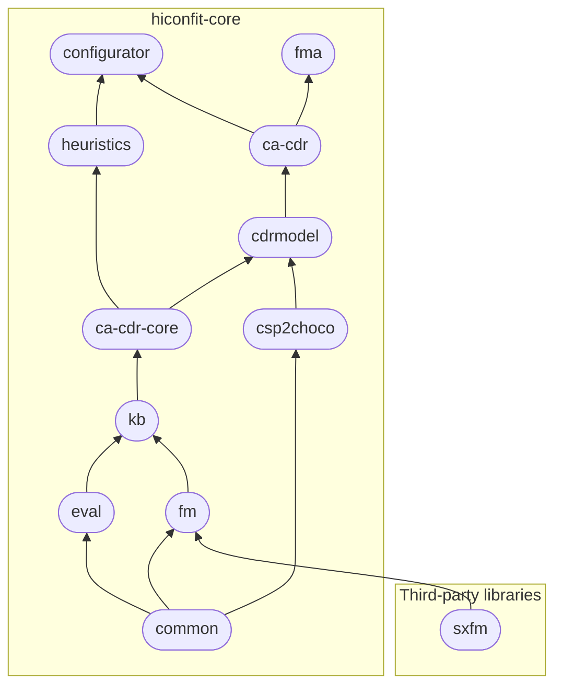

# hiconfit-core
{: .no_toc }
{: .d-inline-block }

v1.0
{: .label .label-purple }

**hiconfit-core** provides a set of Maven-based libraries for High-Performance Knowledge Based Configuration Techniques. It is organized in 11 following Maven libraries:

<!-- ## What hiconfit-core provide -->

| *library*                                       | *description*                            |
|:----------------------------------------------|:------------------------------------------|
| [common] | provides utility functions |
| [csp2choco] | provides a translator converting CSP constraints into Choco Solver commands |
| [eval]     | provides a performance evaluator, i.e., counters and timers, which could be used to measure the performance of algorithms |
| [fm]         | provides the management functionalities for basic feature models |
| [kb]    | provides classes managing CSP (Choco) representations of a knowlege base/feature model |
| [ca-cdr-core]  | provides core classes for representing user requirements and solutions of a configurator as well as for managing test cases and test suites |
| [cdrmodel] | provides an programmatic approach to manage/prepare the constraints/test cases for consistency-based algorithms |
| [ca-cdr]     | provides implementations of Consistency-based Algorithms for Conflict Detection and Resolution (CA-CDR) and a ChocoConsistencyChecker |
| [heuristics]         | provides an implementation of Matrix Factorization Based Variable and Value Ordering Heuristics for Constraint Solving and a wrapper for Matrix Factorization algorithm on the basis of the Mahout library |
| [configurator] | provides a compact knolwedge-based configurator supporting Matrix Factorization based Configuration and Recommendation |
| [fma]    | provides a mechnism to automatically generate property-based test cases for feature models and allows the automated determination of faulty constraints in the feature model |

The following diagram shows the libraries' dependency.

<!-- Links -->
<!-- [References]: /references -->
<!-- [ca-cdr]: ca-cdr -->
<!-- [cdrmodel]: cdrmodel -->
<!-- [ca-cdr-core]: ca-cdr-core -->
<!-- [kb]: kb -->
<!-- [fm]: fm -->
<!-- [eval]: eval -->
<!-- [csp2choco]: csp2choco -->
[common]: common
<!-- [fma]: fma -->
<!-- [configurator]: configurator -->
<!-- [heuristics]: heuristics -->